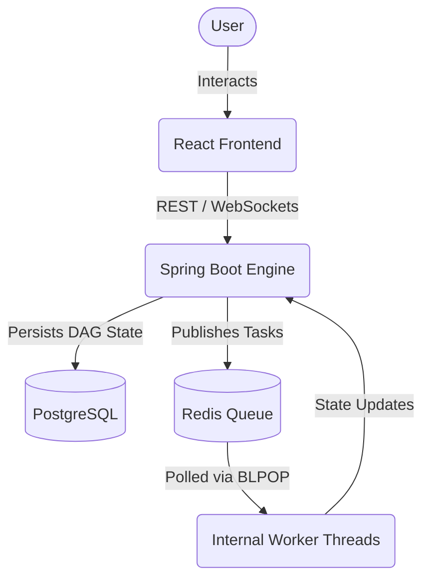

# Taskflow ⚡️ Distributed Task Orchestrator

Taskflow is a real-time, fault-tolerant workflow engine built from the ground up using **Java 21**, **Spring Boot 3**, and **React**. It provides robust distributed orchestration for executing complex Directed Acyclic Graphs (DAGs) of background tasks, complete with automatic retry handling, dependency resolution, and instantaneous WebSocket UI updates.

## Architecture

Taskflow relies on a heavily decoupled, event-driven architecture. It leverages PostgreSQL for ACID-compliant persistent state tracking and Redis as a high-throughput, distributed blocking task queue.



## System Design & Tradeoffs

### Idempotency & State
Workflows are submitted as JSON Directed Acyclic Graphs (DAGs). Rather than maintaining rigid, nested ORM relationships, the engine parses the DAG into lightweight, independent `Task` records stored in PostgreSQL. This guarantees transactional safety, makes individual task retries highly idempotent, and decouples atomic task execution from the overarching orchestrator.

### The Queue (Redis BRPOP)
A common pitfall in task orchestration is utilizing a database polling loop to find pending work, which causes massive CPU thrashing and database locking issues at scale. Taskflow instead pushes pending task IDs onto a Redis List. Worker threads utilize Redis's `BRPOP` (blocking pop) command to efficiently block and wait for work without consuming CPU cycles. This provides instantaneous task routing and scales horizontally with zero database penalty.

### Real-time Telemetry
To achieve a premium, reactive UI, standard HTTP polling was discarded. Instead, Taskflow utilizes STOMP over WebSockets. As background worker threads pull tasks from Redis and mutate their status (e.g., `PENDING` -> `RUNNING`), an internal `EventPublisherService` broadcasts those mutations. The React frontend consumes these STOMP events in real-time, resulting in instantaneous, fluid state changes on the SVG DAG visualizer.

## 🚀 Quick Start

To spin up the entire distributed architecture (PostgreSQL, Redis, Spring Boot, and React) locally, run the following commands:

```bash
git clone <your-repo-url> && cd taskflow
docker compose up -d --build
```

> **Note:** The Spring Boot backend is configured to automatically run Flyway migrations on startup to initialize the PostgreSQL schema.

Once the containers are running, open your browser and navigate to:
**http://localhost:5173**

### Monitoring

To watch the internal Java worker threads polling Redis and executing tasks in real-time, you can tail the backend logs:

```bash
docker compose logs -f backend
```

## 🗺️ Roadmap / Future Improvements

To transition Taskflow from a robust foundational engine into an enterprise-scale distributed platform, the following architectural enhancements are planned:

- **Decoupled Worker Fleet:** Externalize the internal worker simulation into standalone, independently scalable Docker containers that connect back to the Redis queue, allowing for elastic horizontal scaling based on workload.
- **OpenTelemetry & Tracing:** Integrate Jaeger or Zipkin via OpenTelemetry to provide distributed trace propagation across the API, message broker, and worker fleets for deep observability.
- **Exactly-Once Guarantees:** Implement a saga pattern or two-phase commit (2PC) protocol to upgrade our current at-least-once delivery to strict exactly-once execution guarantees for sensitive financial payloads.
- **Kafka Integration:** Replace or supplement Redis with Apache Kafka to provide durable, replayable event streaming and significantly higher throughput for massive task fan-outs.
